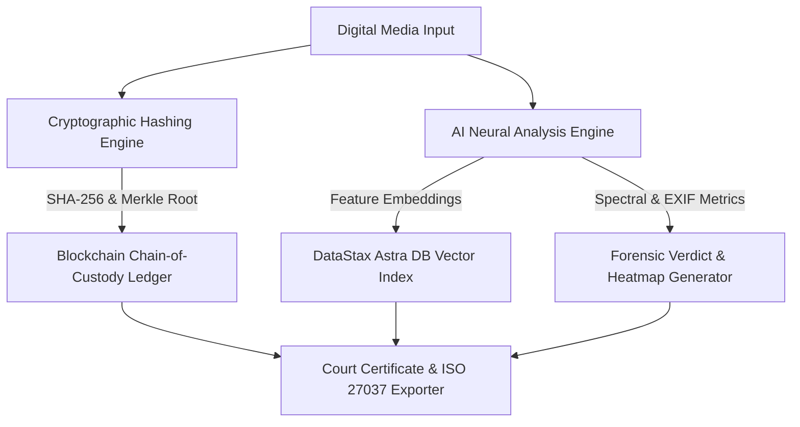

# NeuroShield System Architecture & Threat Model

## Executive Overview
**NeuroShield** is an enterprise digital evidence verification platform designed for law enforcement, judicial proceedings, and forensic investigators. It combines cryptographic hashing (SHA-256 / Merkle Trees), AI neural deepfake detection models, DataStax Astra DB vector similarity indexing, and Ethereum smart contract chain-of-custody logging to provide tamper-evident proof for digital media.

---

## High-Level Architecture Pipeline

---

## Core Technical Layers

### 1. Evidence Ingestion & Cryptographic Hashes
- **SHA-256 Digest**: Computes immutable 256-bit hashes using Web Crypto API (`crypto.subtle.digest`).
- **Merkle Tree Batch Hashes**: Aggregates batch evidence files into a single root Merkle hash, providing efficient zero-knowledge membership proofs for multi-file evidence cases.

### 2. Neural Audio & Video Spectrum Analyzer
- **Audio Frequency Bins**: Performs FFT decomposition into 24 frequency bands (20 Hz – 20 kHz).
- **Synthetic Voice Metrics**: Evaluates pitch stability, high-frequency cutoff points (e.g., sharp 12kHz/14.5kHz roll-offs), and robotic harmonic ratios.
- **Image/Video EXIF Tampering**: Inspects header metadata for AI generative signatures (e.g., Midjourney v6, Stable Diffusion, DALL-E 3).

### 3. DataStax Astra DB Vector Storage
- **Similarity Search**: Queries high-dimensional vector embeddings of scanned media to detect previously flagged deepfakes across global database clusters.
- **Latency & Fallback**: Real-time health check endpoint with graceful offline fallback when credentials are not present.

### 4. Smart Contract Chain-of-Custody
- **Ethereum / Solidity Ledger**: Stores immutable timestamped hashes on-chain (`storeEvidenceHash`, `verifyEvidenceHash`).
- **Court Certificate Export**: Produces ISO 27037 compliant audit reports with QR verification codes for courtroom presentation.

---

## Threat Model & Security Mitigations

| Threat Vector | Risk Level | Mitigation Strategy |
| :--- | :--- | :--- |
| **Generative Voice Cloning** | High | Multi-band FFT spectral centroid analysis & robotic harmonic cutoff detection |
| **EXIF Metadata Stripping** | Medium | Dual-pass analysis combining raw pixel artifact inspection with EXIF header parsing |
| **Evidence Tampering in Transit** | Critical | Client-side SHA-256 hash generation prior to API submission |
| **False Positive Court Filings** | High | Merkle root validation + multi-investigator signature requirement |
